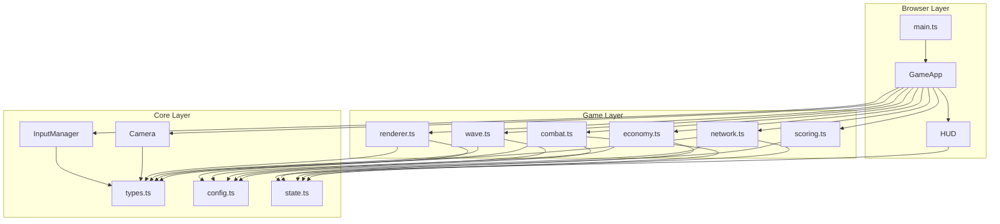
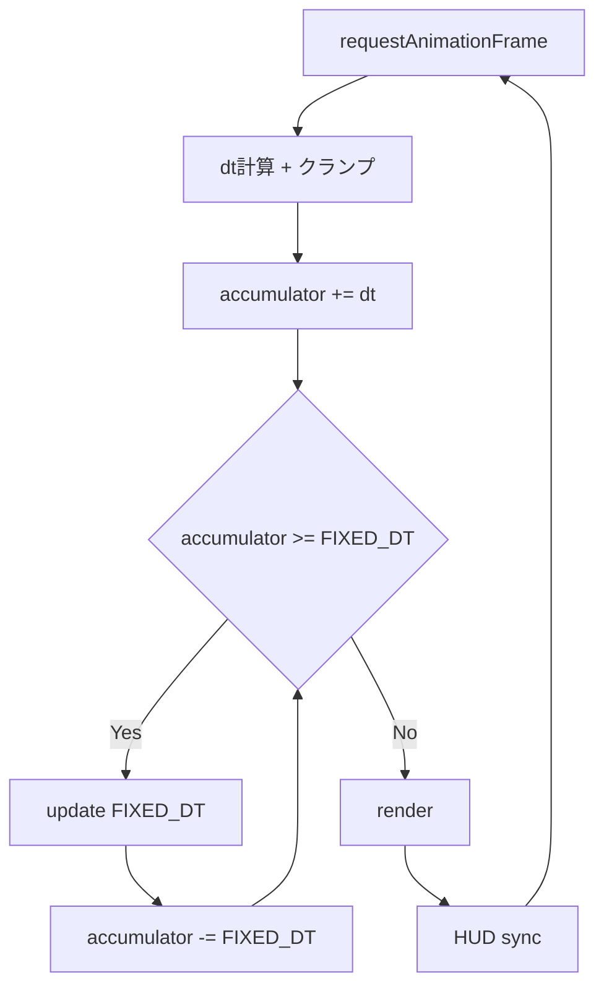
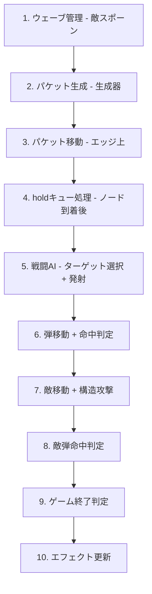
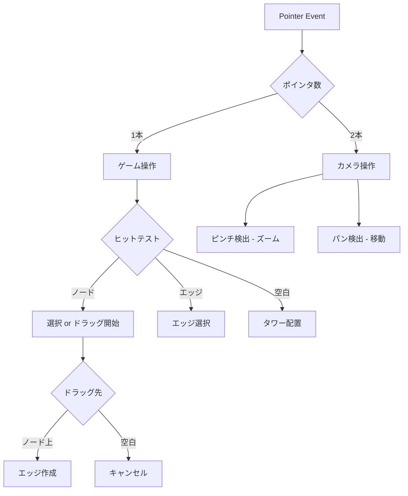
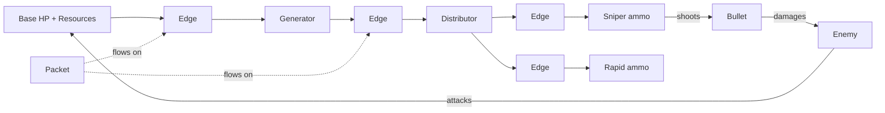

# Technical Design: production-init

## Overview

**Purpose**: mockup/part003で検証済みのNetwork Tower Defenceを、TypeScript + Vite + Canvas2Dで本番品質のゲームとして構築する。

**Users**: タワーディフェンス好きのゲーマー、ネットワーク技術に興味を持つユーザーがPC/モバイルブラウザでプレイする。

**Impact**: 新規プロジェクト（greenfield）。mockup/part003のゲームメカニクスを3層アーキテクチャで再構築する。

### Goals
- 3層アーキテクチャ（Core/Game/Browser）でmockupの全機能を型安全に再実装
- カメラシステム（zoom/pan）によるモバイル対応を初期から組み込み
- Map<ID, Entity>による安全な状態管理でmockupのインデックスバグを根絶

### Non-Goals
- ランキング登録機能（後続スペック）
- マルチプレイヤー/ネットワーク通信
- SE/BGMの実装（アーキテクチャ定義のみ、実装は後続）
- ネイティブアプリ化（Capacitor/Electron）

## Architecture

### Architecture Pattern & Boundary Map



**Architecture Integration**:
- **Selected pattern**: 3層オニオンアーキテクチャ + MVP。依存は内側方向のみ
- **Domain boundaries**: Core（データ＋エンジン基盤）、Game（ゲームロジック＋描画）、Browser（統合＋UI）
- **Existing patterns preserved**: mockupのモジュール分割（graph/packet/enemy/bullet/renderer/config）を踏襲
- **New components rationale**: Camera/InputManagerは全操作の基盤、GameAppはPresenter役
- **Steering compliance**: 依存ルール `Browser → Game → Core` 厳守

### Technology Stack

| Layer | Choice / Version | Role in Feature | Notes |
|-------|------------------|-----------------|-------|
| Language | TypeScript 5.x strict | 型安全なゲームコード | `any`禁止 |
| Build | Vite 6.x | HMR開発 + 本番ビルド | esbuild + terser |
| Rendering | Canvas 2D API | ゲーム描画 | ネイティブAPI |
| UI Reactive | @preact/signals-core 1.x | HUD DOM自動更新 | Browser層のみ |
| Input | Pointer Events API | マウス＋タッチ統合 | ネイティブAPI |
| Deploy | GitHub Pages | 静的ファイルホスティング | Vite base設定 |

## System Flows

### ゲームループフロー



### update(dt) 処理順序



### 入力判定フロー



## Requirements Traceability

| Requirement | Summary | Components | Interfaces |
|-------------|---------|------------|------------|
| 1.1-1.7 | プロジェクト基盤 | 全体 | vite.config, tsconfig |
| 2.1-2.4 | ゲームループ | GameApp | GameLoop |
| 3.1-3.7 | カメラ | Camera | CameraState, transform |
| 4.1-4.7 | 入力 | InputManager | InputState, PointerInfo |
| 5.1-5.4 | 状態管理 | State | GameState, generateId |
| 6.1-6.7 | トポロジー | State, Network | TowerNode, Edge |
| 7.1-7.8 | パケット | Network | Packet, updatePackets |
| 8.1-8.7 | 戦闘 | Combat | Bullet, updateCombat |
| 9.1-9.10 | 敵 | Wave | Enemy, updateEnemies |
| 10.1-10.6 | ウェーブ | Wave | WaveDef, WaveState |
| 11.1-11.8 | 経済 | Economy | canAfford, purchase |
| 12.1-12.8 | 描画 | Renderer | render |
| 13.1-13.4 | エフェクト | Renderer | Effect |
| 14.1-14.6 | UI/HUD | HUD, GameApp | HUDSignals |
| 15.1-15.4 | スコアリング | Scoring | calculateScore |
| 16.1-16.3 | デプロイ | vite.config | — |

## Components and Interfaces

| Component | Layer | Intent | Req Coverage | Key Dependencies | Contracts |
|-----------|-------|--------|--------------|-----------------|-----------|
| types.ts | Core | 全エンティティの型定義 | 5, 6 | — | State |
| config.ts | Core | バランスパラメータ | 6, 7, 8, 9, 10, 11 | types (P0) | — |
| state.ts | Core | GameState定義 + ID生成 | 5.1-5.4 | types (P0) | State |
| Camera | Core | zoom/pan + 座標変換 | 3.1-3.7 | types (P0) | State |
| InputManager | Core | Pointer Events統合 | 4.1-4.7 | Camera (P0) | State |
| network.ts | Game | パケット生成・移動・キュー | 7.1-7.8 | state, config (P0) | Service |
| combat.ts | Game | ターゲット選択・弾・命中 | 8.1-8.7 | state, config (P0) | Service |
| wave.ts | Game | 敵スポーン・移動・攻撃 | 9.1-9.10, 10.1-10.6 | state, config (P0) | Service |
| economy.ts | Game | リソース・コスト・アップグレード | 11.1-11.8 | state, config (P0) | Service |
| scoring.ts | Game | スコア計算・妥当性チェック | 15.1-15.4 | state (P0) | Service |
| renderer.ts | Game | Canvas 2D全描画 | 12.1-12.8, 13.1-13.4 | types, config, Camera (P0) | Service |
| GameApp | Browser | ゲームループ + Presenter | 2.1-2.4, 14.6 | 全Game関数 (P0) | Service |
| HUD | Browser | Preact Signals UIバインド | 14.1-14.5 | state (P0), Signals (P1) | State |

### Core Layer

#### types.ts

| Field | Detail |
|-------|--------|
| Intent | 全エンティティのTypeScript型定義と列挙型 |
| Requirements | 5.1, 5.2, 6.1, 6.5, 6.6 |

**Responsibilities & Constraints**
- 全層から参照される唯一の型定義ソース
- ランタイムロジックを含まない（型のみ）
- ブランド型IDでエンティティ種別をコンパイル時に区別

**Contracts**: State [x]

##### State Management

```typescript
// ── ブランド型ID ──
type NodeId = string & { readonly __brand: 'NodeId' };
type EdgeId = string & { readonly __brand: 'EdgeId' };
type PacketId = string & { readonly __brand: 'PacketId' };
type EnemyId = string & { readonly __brand: 'EnemyId' };
type BulletId = string & { readonly __brand: 'BulletId' };

// ── ノード種別 ──
type NodeType = 'generator' | 'sniper' | 'rapid' | 'cannon' | 'distributor' | 'repeater';
type AttackNodeType = 'sniper' | 'rapid' | 'cannon';

// ── 敵種別 ──
type EnemyType = 'normal' | 'fast' | 'tank' | 'edgeAttacker' | 'towerAttacker' | 'disabler';

// ── ノード状態 ──
type NodeStatus = 'building' | 'active' | 'upgrading' | 'disabled';

// ── エッジ状態 ──
type EdgeStatus = 'active' | 'disabled' | 'destroyed';

// ── エンティティ定義 ──
interface TowerNode {
  readonly id: NodeId;
  type: NodeType;
  x: number;
  y: number;
  level: number;
  hp: number;
  maxHp: number;
  status: NodeStatus;
  ammo: number;
  nextOut: number;
  buildTimer: number;
  upgradeTimer: number;
  disableTimer: number;
  held: HeldPacket[];
}

interface Edge {
  readonly id: EdgeId;
  from: NodeId;
  to: NodeId;
  level: number;
  hp: number;
  maxHp: number;
  status: EdgeStatus;
  disableTimer: number;
}

interface Packet {
  readonly id: PacketId;
  edgeId: EdgeId;
  progress: number;
  charge: number;
  speed: number;
}

interface HeldPacket {
  timer: number;
  fromEdgeId: EdgeId;
  charge: number;
}

interface Enemy {
  readonly id: EnemyId;
  type: EnemyType;
  x: number;
  y: number;
  hp: number;
  maxHp: number;
  speed: number;
  pathIndex: number;
  pathProgress: number;
  reward: number;
  strength: number;
  attackTimer: number;
}

interface Bullet {
  readonly id: BulletId;
  x: number;
  y: number;
  prevX: number;
  prevY: number;
  targetId: EnemyId;
  deadPos: { x: number; y: number } | null;
  speed: number;
  damage: number;
  towerType: NodeType;
  level: number;
}

interface Effect {
  type: 'muzzle' | 'impact' | 'explosion' | 'upgrade';
  x: number;
  y: number;
  timer: number;
  duration: number;
  color: string;
  params: Record<string, number>;
}
```

#### config.ts

| Field | Detail |
|-------|--------|
| Intent | レベル別バランスパラメータとコスト表 |
| Requirements | 6.5, 6.6, 7.7, 8.5, 8.6, 11.2-11.4 |

**Responsibilities & Constraints**
- 純粋データのみ（関数なし）
- mockup/part003/js/config.jsから移植

**Contracts**: State [x]

##### State Management
```typescript
interface GameConfig {
  readonly PACKET_SPEED: number;
  readonly MAX_EDGE_LENGTH: number;
  readonly FIXED_DT: number;
  readonly BASE_HP: number;
  readonly INITIAL_RESOURCES: number;

  readonly towerLevels: Readonly<Record<NodeType, ReadonlyArray<TowerLevelStats>>>;
  readonly edgeLevels: ReadonlyArray<EdgeLevelStats>;
  readonly towerCosts: Readonly<Record<NodeType, number>>;
  readonly upgradeCosts: ReadonlyArray<number>;
  readonly edgeUpgradeCosts: ReadonlyArray<number>;
  readonly buildDuration: number;
  readonly upgradeDuration: number;
}

interface TowerLevelStats {
  readonly hp: number;
  readonly holdTime: number;
  // 攻撃タワーのみ
  readonly cooldown?: number;
  readonly damage?: number;
  readonly range?: number;
  readonly ammoPerShot?: number;
  // 生成器のみ
  readonly interval?: number;
  // 分配器のみ
  readonly maxFanout?: number;
  // リピーターのみ
  readonly chargeBoost?: number;
}

interface EdgeLevelStats {
  readonly capacity: number;
  readonly speedMultiplier: number;
  readonly hp: number;
}
```

#### state.ts

| Field | Detail |
|-------|--------|
| Intent | GameState定義、ID生成、Mapヘルパー関数 |
| Requirements | 5.1-5.4 |

**Contracts**: State [x] / Service [x]

##### State Management
```typescript
interface GameState {
  nodes: Map<NodeId, TowerNode>;
  edges: Map<EdgeId, Edge>;
  packets: Map<PacketId, Packet>;
  enemies: Map<EnemyId, Enemy>;
  bullets: Map<BulletId, Bullet>;
  enemyBullets: Map<BulletId, Bullet>;
  effects: Effect[];
  resources: number;
  baseHp: number;
  maxBaseHp: number;
  waveIndex: number;
  wavePhase: 'prep' | 'active' | 'complete';
  simTime: number;
  simSpeed: number;
  gameResult: 'playing' | 'victory' | 'defeat';
}
```

##### Service Interface
```typescript
function createGameState(config: GameConfig): GameState;
function generateNodeId(): NodeId;
function generateEdgeId(): EdgeId;
function generatePacketId(): PacketId;
function generateEnemyId(): EnemyId;
function generateBulletId(): BulletId;

// エッジ検索ヘルパー
function outgoingEdges(state: GameState, nodeId: NodeId): Edge[];
function incomingEdges(state: GameState, nodeId: NodeId): Edge[];
function edgesBetween(state: GameState, a: NodeId, b: NodeId): Edge[];
```

#### Camera

| Field | Detail |
|-------|--------|
| Intent | zoom/pan状態管理、screen↔world座標変換 |
| Requirements | 3.1-3.7 |

**Contracts**: State [x] / Service [x]

##### State Management
```typescript
interface CameraState {
  x: number;
  y: number;
  zoom: number;
  minZoom: number;
  maxZoom: number;
  viewportWidth: number;
  viewportHeight: number;
}
```

##### Service Interface
```typescript
class Camera {
  state: CameraState;
  screenToWorld(sx: number, sy: number): { x: number; y: number };
  worldToScreen(wx: number, wy: number): { x: number; y: number };
  applyTransform(ctx: CanvasRenderingContext2D): void;
  resetTransform(ctx: CanvasRenderingContext2D): void;
  zoomAt(centerX: number, centerY: number, delta: number): void;
  pan(dx: number, dy: number): void;
  resize(width: number, height: number): void;
}
```

#### InputManager

| Field | Detail |
|-------|--------|
| Intent | Pointer Events統合、1本指/2本指判定、ジェスチャー検出 |
| Requirements | 4.1-4.7, 3.1-3.3 |

**Dependencies**
- Outbound: Camera — 座標変換 (P0)

**Contracts**: State [x] / Service [x]

##### State Management
```typescript
interface PointerInfo {
  id: number;
  x: number;
  y: number;
  worldX: number;
  worldY: number;
}

interface InputState {
  pointers: Map<number, PointerInfo>;
  pointerCount: number;
  isDragging: boolean;
  dragStartNodeId: NodeId | null;
  lastTapWorldPos: { x: number; y: number } | null;
  pinchStartDistance: number | null;
  pinchStartZoom: number;
}
```

##### Service Interface
```typescript
class InputManager {
  state: InputState;
  attach(canvas: HTMLCanvasElement, camera: Camera): void;
  detach(): void;
  // フレーム開始時に呼び出し、イベントキューを消費
  consumeActions(): InputAction[];
}

type InputAction =
  | { type: 'tap'; worldX: number; worldY: number }
  | { type: 'select-node'; nodeId: NodeId }
  | { type: 'select-edge'; edgeId: EdgeId }
  | { type: 'drag-start'; nodeId: NodeId }
  | { type: 'drag-end'; nodeId: NodeId | null; worldX: number; worldY: number }
  | { type: 'zoom'; centerX: number; centerY: number; delta: number }
  | { type: 'pan'; dx: number; dy: number };
```

### Game Layer

#### network.ts

| Field | Detail |
|-------|--------|
| Intent | パケット生成・エッジ上移動・ノード到着処理・holdキュー処理 |
| Requirements | 7.1-7.8 |

**Contracts**: Service [x]

##### Service Interface
```typescript
function tickGenerators(state: GameState, config: GameConfig, dt: number): void;
function updatePackets(state: GameState, config: GameConfig, dt: number): void;
function tickHeldPackets(state: GameState, config: GameConfig, dt: number): void;
```
- Preconditions: stateのnodes/edges/packetsが有効なMap
- Postconditions: packets Mapが更新され、到着パケットがheldに追加またはammo/リソースに変換
- Invariants: エッジ容量を超えるパケット送出は行わない

#### combat.ts

| Field | Detail |
|-------|--------|
| Intent | ターゲット選択・弾生成・弾移動・命中判定・ダメージ処理 |
| Requirements | 8.1-8.7 |

**Contracts**: Service [x]

##### Service Interface
```typescript
function updateTowerAttacks(state: GameState, config: GameConfig, dt: number): void;
function updateBaseAttack(state: GameState, config: GameConfig, dt: number): void;
function updateBullets(state: GameState, dt: number): BulletHit[];
function updateEnemyBullets(state: GameState, dt: number): void;

interface BulletHit {
  targetId: EnemyId;
  damage: number;
  towerType: NodeType;
  level: number;
  x: number;
  y: number;
}
```

#### wave.ts

| Field | Detail |
|-------|--------|
| Intent | ウェーブ管理・敵スポーン・敵移動・敵攻撃行動（エッジ/タワー/ディスエーブル） |
| Requirements | 9.1-9.10, 10.1-10.6 |

**Contracts**: Service [x]

##### Service Interface
```typescript
function updateWaveSpawning(state: GameState, config: GameConfig, dt: number): void;
function updateEnemies(state: GameState, config: GameConfig, dt: number): void;
function startWave(state: GameState): void;
function checkGameEnd(state: GameState): 'playing' | 'victory' | 'defeat';
```

#### economy.ts

| Field | Detail |
|-------|--------|
| Intent | リソース管理・配置/アップグレードのコスト判定・建設タイマー |
| Requirements | 11.1-11.8 |

**Contracts**: Service [x]

##### Service Interface
```typescript
function canAfford(state: GameState, config: GameConfig, action: EconomyAction): boolean;
function purchase(state: GameState, config: GameConfig, action: EconomyAction): boolean;
function refund(state: GameState, config: GameConfig, nodeId: NodeId): number;
function updateBuildTimers(state: GameState, config: GameConfig, dt: number): void;

type EconomyAction =
  | { type: 'place-tower'; nodeType: NodeType }
  | { type: 'upgrade-tower'; nodeId: NodeId }
  | { type: 'upgrade-edge'; edgeId: EdgeId }
  | { type: 'create-edge' };
```

#### scoring.ts

| Field | Detail |
|-------|--------|
| Intent | スコア算出・理論上限チェック |
| Requirements | 15.1-15.4 |

**Contracts**: Service [x]

##### Service Interface
```typescript
interface ScoreResult {
  total: number;
  breakdown: {
    waveBonus: number;
    hpBonus: number;
    resourceBonus: number;
    timeBonus: number;
  };
  maxPossible: number;
}

function calculateScore(state: GameState, config: GameConfig): ScoreResult;
function calculateMaxScore(waveIndex: number, elapsedTime: number, config: GameConfig): number;
```

#### renderer.ts

| Field | Detail |
|-------|--------|
| Intent | Canvas 2D APIによる全ゲーム要素描画 |
| Requirements | 12.1-12.8, 13.1-13.4 |

**Dependencies**
- Inbound: GameApp — 毎フレーム呼び出し (P0)
- Outbound: Camera — applyTransform (P0)

**Contracts**: Service [x]

##### Service Interface
```typescript
function render(
  ctx: CanvasRenderingContext2D,
  state: GameState,
  config: GameConfig,
  camera: Camera,
  ui: UIState,
  assets: AssetMap
): void;

// ヒットテスト（入力処理で使用）
function hitTestNode(state: GameState, worldX: number, worldY: number): NodeId | null;
function hitTestEdge(state: GameState, worldX: number, worldY: number): EdgeId | null;

interface UIState {
  selectedNodeId: NodeId | null;
  selectedEdgeId: EdgeId | null;
  selectedTool: NodeType;
  hoveredNodeId: NodeId | null;
  dragPreview: { fromId: NodeId; toX: number; toY: number } | null;
}

type AssetMap = Map<string, HTMLImageElement>;
```

### Browser Layer

#### GameApp

| Field | Detail |
|-------|--------|
| Intent | ゲームループ統合。Presenterとして全Game関数を呼びViewに渡す |
| Requirements | 2.1-2.4, 14.6 |

**Dependencies**
- Outbound: 全Game層関数 (P0)、Camera (P0)、InputManager (P0)、HUD (P1)、Renderer (P0)

**Contracts**: Service [x]

##### Service Interface
```typescript
class GameApp {
  constructor(canvas: HTMLCanvasElement, config: GameConfig);
  start(): void;
  pause(): void;
  resume(): void;
  setSimSpeed(speed: number): void;
  handleAction(action: PlayerAction): void;
}

type PlayerAction =
  | { type: 'place-tower'; nodeType: NodeType; x: number; y: number }
  | { type: 'create-edge'; from: NodeId; to: NodeId }
  | { type: 'select-node'; nodeId: NodeId }
  | { type: 'select-edge'; edgeId: EdgeId }
  | { type: 'deselect' }
  | { type: 'upgrade-tower'; nodeId: NodeId }
  | { type: 'upgrade-edge'; edgeId: EdgeId }
  | { type: 'destroy-tower'; nodeId: NodeId }
  | { type: 'destroy-edge'; edgeId: EdgeId }
  | { type: 'reverse-edge'; edgeId: EdgeId }
  | { type: 'start-wave' };
```

#### HUD

| Field | Detail |
|-------|--------|
| Intent | Preact SignalsでGameState値をDOM要素に自動バインド |
| Requirements | 14.1-14.5 |

**Dependencies**
- External: @preact/signals-core (P1)

**Contracts**: State [x]

##### State Management
```typescript
import { signal, computed, effect } from '@preact/signals-core';

interface HUDSignals {
  baseHp: Signal<number>;
  maxBaseHp: Signal<number>;
  resources: Signal<number>;
  waveIndex: Signal<number>;
  enemyCount: Signal<number>;
  simSpeed: Signal<number>;
  gameResult: Signal<'playing' | 'victory' | 'defeat'>;
  // computed
  hpPercent: ReadonlySignal<number>;
}

function createHUD(container: HTMLElement): HUDSignals;
function syncHUD(signals: HUDSignals, state: GameState): void;
```

## Data Models

### Domain Model



**Aggregates**:
- **GameState**: 唯一のルートアグリゲート。全エンティティMapを所有
- 個別エンティティはアグリゲートを持たない（フラットなMap管理）

**Business Rules**:
- パケットは参照先edgeIdが無効なら次updateで消滅
- 弾は参照先targetIdの敵が存在しなければdeadPosへ慣性飛行
- エッジ削除はfrom/toノードの整合性を壊さない（IDなので参照切れのみ）

### Logical Data Model

**Structure**: 全エンティティはGameState内のMap<BrandedId, Entity>に格納

**Referential Integrity**: 遅延クリーンアップ方式
- 削除はMapからdeleteするだけ
- 参照元は次フレームのupdate内で「参照先が存在しない」ことを検知して自然に処理
- 明示的なカスケード削除はノード撤去時のエッジ連動削除のみ

## Error Handling

### Error Strategy
- **ゲームロジックエラー**: 防御的プログラミング。存在しないIDへの参照はスキップ（クラッシュしない）
- **描画エラー**: アセット未ロード時はフォールバック図形（円・四角）で描画
- **入力エラー**: 無効な操作（コスト不足、距離超過）はUI上で拒否表示

### Error Categories and Responses
- **Invalid ID Reference**: Map.get()がundefined → 処理スキップ、エンティティ消滅扱い
- **Insufficient Resources**: canAfford()がfalse → UI上で操作不可表示
- **Asset Load Failure**: SVGロード失敗 → config色でのフォールバック円描画
- **Visibility Change**: document.hidden → ゲームループ一時停止

## Testing Strategy

### Unit Tests
- state.ts: ID生成の一意性、GameState作成、エッジ検索ヘルパー
- network.ts: パケット移動、容量制限、holdTime処理、charge分割
- combat.ts: ターゲット選択（最近接）、弾移動、命中判定、deadPos慣性飛行
- economy.ts: コスト計算、リソース不足判定、撤去返金
- scoring.ts: スコア計算、理論上限算出

### Integration Tests
- パケットフロー: 生成器→エッジ→攻撃タワー→ammo変換→弾発射→敵命中
- 経済フロー: タワー配置→リソース消費→敵撃破→リソース回収
- ディスエーブラー: 敵到達→タワー無効化→パケット停止→タイマー満了→復帰

### E2E Tests
- ブラウザ上でCanvasが表示される
- タップでタワー配置、ドラッグでエッジ接続
- ウェーブ開始→敵出現→攻撃→撃破の一連フロー
- ピンチズーム・パンが動作する（モバイルエミュレーション）

## Performance & Scalability

- **ターゲット**: 60fps安定（PC）、30fps以上（モバイル）
- **エンティティ上限目安**: ノード30、エッジ50、パケット200、敵100、弾50
- **描画最適化**: カメラ範囲外のエンティティは描画スキップ（将来的にviewport culling）
- **固定タイムステップ**: ロジック負荷が描画から分離されるため、描画フレームスキップで性能担保
