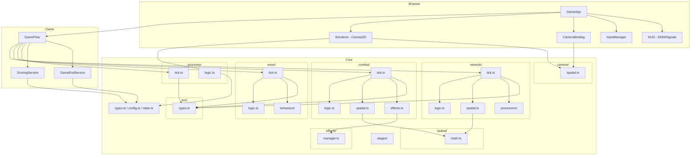
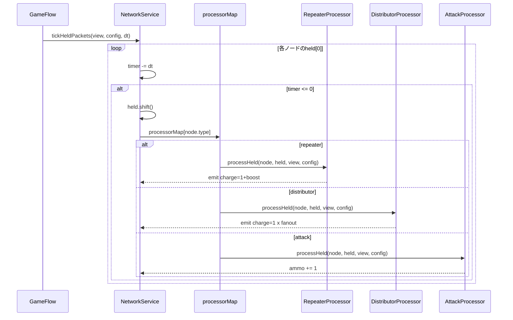
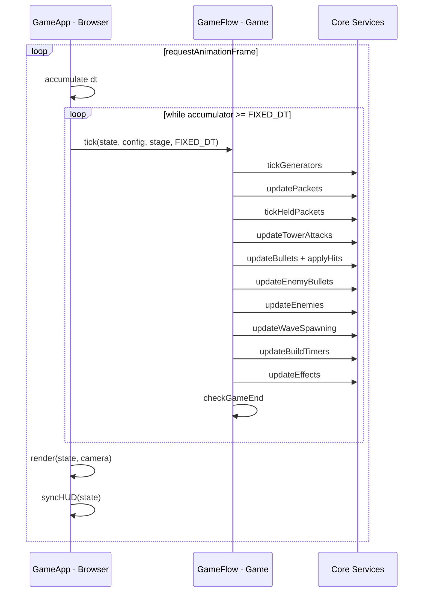

# Design Document: three-layer-refactor

## Overview

**Purpose**: コードベースを3層アーキテクチャ（Core/Game/Browser）にリファクタリングし、Core層の描画API非依存化によりvitestでのヘッドレステストを実現する。Strategy pattern導入でノード処理・敵行動の拡張性を確保し、View interfaceでサービス間疎結合を達成する。

**Users**: 開発者がCore層を単体テスト・シミュレーターで利用し、将来の機能追加時にOCP準拠で拡張する。

**Impact**: 既存の`src/core/`からブラウザAPI依存コード（Camera ctx操作、InputManager）をBrowser層へ移動。`src/game/renderer.ts`をBrowser層へ移動。GameConfigからStageData分離。processHeldPacketのswitch文をStrategy patternに置換。Core層内はドメイン別にフォルダ分割し、各ドメイン内でロジック/tick/spatial/effectsの責務を分離。

### Goals
- Core層からブラウザAPI依存を完全排除し、ヘッドレステスト可能にする
- NodeProcessor/EnemyBehavior Strategy導入でOCP準拠を達成する
- vitestによるCore層・Game層のユニットテストを確立する
- 既存ゲームの動作を維持する

### Non-Goals
- TowerNode Discriminated Union化（別specで実施）
- WebGL移行やレンダリング最適化
- E2Eテスト（Playwright等）の導入
- 新機能の追加

## Architecture

### Existing Architecture Analysis

現在の層構造と問題点:

| 層 | 現状 | 問題 |
|---|---|---|
| Core | types, config, state, **camera(ctx依存)**, **input(DOM依存)** | Camera.applyTransformとInputManager全体がブラウザAPI依存 |
| Game | network, combat, wave, economy, **renderer(1300行Canvas2D)**, scoring | renderer.tsが全描画+エフェクト生成+ヒットテストを担当 |
| Browser | game-app, hud | game-appがrenderer直呼び、hud がgame/networkをimport |

### Architecture Pattern & Boundary Map



**Architecture Integration**:
- **Selected pattern**: 3層レイヤードアーキテクチャ + ドメイン別責務分割 + Strategy pattern
- **Core内部構造**: 各ドメインフォルダ内でlogic(ルール)/tick(オーケストレーション)/spatial(座標計算)/effects(演出)に責務分離。tickが他を呼び出してオーケストレーション。共通基盤（spatial/math, tick/types, effects/manager）をドメイン横断で共有
- **Domain boundaries**: Core=シミュレーション純粋ロジック、Game=フロー統合、Browser=描画/入力/UI
- **Existing patterns preserved**: Map<ID, Entity>、純粋関数によるstate更新、Preact Signals
- **New components**: NodeProcessor interface, EnemyBehavior interface, View interfaces, StageData, GameFlow, CameraBinding
- **Steering compliance**: 依存方向Browser→Game→Core維持、パスエイリアス既存通り

### Core層 ドメイン別ファイルマッピング

```
core/
  types.ts                型定義・View Interface
  config.ts               ゲーム共通定数・レベルテーブル
  state.ts                GameState・MetricsStore・ID生成
  stages/
    stage1.ts             ステージ1データ（enemyPath, waveDefs, nodeSlots等）
    index.ts              全ステージexport

  network/                パケットシステム
    logic.ts                容量チェック、charge規則、emit共通ヘルパー
    tick.ts                 tickGenerators, updatePackets, tickHeldPackets オーケストレーション
    spatial.ts              packetPosition計算
    processors/
      types.ts              NodeProcessor interface
      repeater.ts           charge=1+boost → 1エッジ
      distributor.ts        charge=1 × fanout → Nエッジ
      attack.ts             ammo += 1
      index.ts              processorMap

  combat/                 戦闘システム
    logic.ts                ダメージ計算、命中判定ルール
    tick.ts                 updateTowerAttacks, updateBullets, updateEnemyBullets オーケストレーション
    spatial.ts              射程判定、弾道計算
    effects.ts              マズルフラッシュ・爆発・着弾エフェクト生成

  wave/                   ウェーブシステム
    logic.ts                スポーン規則、経路移動計算
    tick.ts                 updateWaveSpawning, updateEnemies オーケストレーション
    behaviors/
      types.ts              EnemyBehavior interface
      path.ts               経路移動のみ
      edge-attack.ts        Edge攻撃
      tower-attack.ts       Node攻撃
      index.ts              behaviorMap

  economy/                経済システム
    logic.ts                コスト計算、リソース管理ルール
    tick.ts                 updateBuildTimers オーケストレーション

  camera/                 カメラ
    spatial.ts              座標変換・zoom・pan（純粋数学）

  interaction/            インタラクション
    actions.ts              InputAction型定義

  spatial/                共通座標基盤
    math.ts                 Vec2演算, dist, pointInCircle, lerp, normalize等

  tick/                   共通Tick基盤
    types.ts                DomainTick interface, 共通タイマーユーティリティ

  effects/                共通エフェクト基盤
    manager.ts              addEffect, updateEffects, updateEffectPositions
```

### Technology Stack

| Layer | Choice / Version | Role in Feature | Notes |
|-------|------------------|-----------------|-------|
| テスト | vitest ^3.x | Core/Gameヘッドレステスト | Vite設定共有、パスエイリアス自動解決 |
| ビルド | Vite 6.x (既存) | TypeScriptコンパイル + バンドル | 変更なし |
| 言語 | TypeScript 5.7 (既存) | strict mode | 変更なし |
| UI | Preact Signals (既存) | HUDリアクティブ更新 | 変更なし |

## System Flows

### パケット処理フロー（Strategy dispatch）



### ゲームループフロー



## Requirements Traceability

| Requirement | Summary | Components | Interfaces | Flows |
|-------------|---------|------------|------------|-------|
| 1.1 | Core層ブラウザAPI排除 | Camera, Effects | — | — |
| 1.2 | ヘッドレスコンパイル | 全Core | — | — |
| 1.3 | Core含有ロジック | NetworkService, CombatService, WaveService, EconomyService | — | — |
| 1.4 | Camera純粋数学 | Camera | — | — |
| 2.1 | GameFlow呼び出し順制御 | GameFlow | — | ゲームループフロー |
| 2.2 | Game層ロジック非含有 | GameFlow | — | — |
| 2.3 | ScoringService集計 | ScoringService | MetricsStore | — |
| 2.4 | GameEndService判定 | GameEndService | GameState | — |
| 3.1 | Renderer Canvas2D描画 | Renderer | GameState, Camera | — |
| 3.2 | CameraBinding | CameraBinding | Camera | — |
| 3.3 | InputManager | InputManager | InputAction | — |
| 3.4 | HUD DOM/Signals | HUD | HUDSignals | — |
| 4.1 | StageData保持 | StageData | — | — |
| 4.2 | GameConfig共通定数のみ | GameConfig | — | — |
| 4.3 | ステージ追加容易性 | core/stages/ | StageData | — |
| 4.4 | WaveService StageData引数 | WaveService | StageData | — |
| 5.1 | processorMap dispatch | NetworkService | NodeProcessor | パケット処理フロー |
| 5.2 | OCP拡張性 | processorMap | NodeProcessor | — |
| 5.3 | RepeaterProcessor | RepeaterProcessor | NodeProcessor | パケット処理フロー |
| 5.4 | DistributorProcessor | DistributorProcessor | NodeProcessor | パケット処理フロー |
| 5.5 | AttackProcessor | AttackProcessor | NodeProcessor | パケット処理フロー |
| 6.1 | behaviorMap dispatch | WaveService | EnemyBehavior | — |
| 6.2 | OCP拡張性 | behaviorMap | EnemyBehavior | — |
| 6.3-6.5 | 各Behavior実装 | PathBehavior, EdgeAttackBehavior, TowerAttackBehavior | EnemyBehavior | — |
| 7.1-7.5 | View Interface | NetworkView, CombatView, WaveView, EconomyView | 各View | — |
| 8.1-8.7 | vitest導入 | vitest設定, テストファイル | — | — |
| 9.1-9.5 | 動作保証 | 全コンポーネント | — | — |
| 10.1-10.4 | 依存方向強制 | tsconfig, パスエイリアス | — | — |

## Components and Interfaces

| Component | Domain/Layer | Intent | Req Coverage | Key Dependencies | Contracts |
|-----------|-------------|--------|--------------|------------------|-----------|
| SpatialMath | Core | 共通座標演算基盤 | 1.3 | — | Service |
| TickFoundation | Core | DomainTick interface + タイマーユーティリティ | 2.1 | — | Service |
| EffectsManager | Core | エフェクト生成・更新・位置追跡 | 1.1, 1.3 | GameState (P0) | Service |
| Camera | Core | 座標変換（純粋数学） | 1.4 | — | State |
| StageData | Core | ステージ固有データ定義 | 4.1-4.3 | — | State |
| NetworkService | Core | パケット生成・移動・held処理 | 1.3, 5.1 | NetworkView (P0), NodeProcessor (P0) | Service |
| CombatService | Core | ダメージ・弾処理 | 1.3 | CombatView (P0) | Service |
| WaveService | Core | 敵スポーン・移動 | 1.3, 6.1 | WaveView (P0), EnemyBehavior (P0), StageData (P0) | Service |
| EconomyService | Core | 建設・売却・修理 | 1.3 | EconomyView (P0) | Service |
| NodeProcessor | Core | ノードタイプ別held処理Strategy | 5.1-5.5 | NetworkView (P0) | Service |
| EnemyBehavior | Core | 敵タイプ別行動Strategy | 6.1-6.5 | WaveView (P0) | Service |
| View Interfaces | Core | サービス別部分射影 | 7.1-7.5 | — | State |
| GameFlow | Game | Coreサービス呼び出し順制御 | 2.1-2.2 | 全CoreService (P0) | Service |
| ScoringService | Game | 3軸スコア集計 | 2.3 | MetricsStore (P0) | Service |
| GameEndService | Game | ゲーム終了判定 | 2.4 | GameState (P0) | Service |
| Renderer | Browser | Canvas2D描画 | 3.1 | GameState (P0), Camera (P0) | — |
| CameraBinding | Browser | Canvas2Dバインディング | 3.2 | Camera (P0) | — |
| InputManager | Browser | Pointer Events入力 | 3.3 | — | Service |
| HUD | Browser | DOM/Signals UI | 3.4 | GameState (P0) | — |

### Core Layer

#### SpatialMath（共通座標基盤）

| Field | Detail |
|-------|--------|
| Intent | 全ドメイン共通のベクトル演算・距離計算・幾何判定を提供 |
| Requirements | 1.3 |

**Contracts**: Service [x]

##### Service Interface
```typescript
// core/spatial/math.ts

interface Vec2 {
  x: number;
  y: number;
}

function dist(a: Vec2, b: Vec2): number;
function distSq(a: Vec2, b: Vec2): number;
function normalize(v: Vec2): Vec2;
function scale(v: Vec2, s: number): Vec2;
function add(a: Vec2, b: Vec2): Vec2;
function sub(a: Vec2, b: Vec2): Vec2;
function lerp(a: Vec2, b: Vec2, t: number): Vec2;
function pointInCircle(point: Vec2, center: Vec2, radius: number): boolean;
function segmentNearest(p: Vec2, a: Vec2, b: Vec2): Vec2;
```

**Implementation Notes**
- 現在combat.ts, network.ts, wave.ts, renderer.tsに散在するdist()やベクトル演算を集約
- 全て純粋関数、副作用なし
- Vec2型はcore/types.tsに定義してもよいが、spatial/math.tsからre-exportで十分

---

#### TickFoundation（共通Tick基盤）

| Field | Detail |
|-------|--------|
| Intent | DomainTickインターフェースと共通タイマーユーティリティを提供 |
| Requirements | 2.1 |

**Contracts**: Service [x]

##### Service Interface
```typescript
// core/tick/types.ts

interface DomainTick {
  tick(state: GameState, config: GameConfig, dt: number): void;
}

// 共通タイマーユーティリティ
function decrementCooldown(current: number, dt: number): number;
function isReady(cooldown: number): boolean;
```

**Implementation Notes**
- DomainTick interfaceはGameFlow（Game層）が参照。依存方向: Game→Core で正しい
- 各ドメインのtick.tsはこのinterfaceを実装（satisfies DomainTick）
- タイマーユーティリティは各所のcooldown処理パターンを共通化

---

#### EffectsManager（共通エフェクト基盤）

| Field | Detail |
|-------|--------|
| Intent | エフェクトの生成ヘルパー・タイマー更新・位置追跡を提供（描画API依存ゼロ） |
| Requirements | 1.1, 1.3 |

**Contracts**: Service [x]

##### Service Interface
```typescript
// core/effects/manager.ts

function addEffect(
  effects: Effect[],
  type: string,
  x: number, y: number,
  duration: number,
  params?: Partial<Effect>,
): void;

function updateEffects(effects: Effect[], dt: number): void;
// → タイマー減算、期限切れ削除

function updateEffectPositions(
  effects: Effect[],
  bullets: Map<BulletId, Bullet>,
): void;
// → 弾道追従エフェクトの座標同期
```

- Preconditions: effects配列はGameState.effectsへの参照
- Postconditions: updateEffectsで期限切れエフェクトは配列から削除
- Invariants: 描画コード（Canvas2D）を一切含まない

**Implementation Notes**
- 現在renderer.ts内のupdateEffects/updateEffectPositions/addMuzzleEffect等からロジック部分を抽出
- 各ドメインのeffects.ts（例: combat/effects.ts）はこのmanagerのaddEffectを使用してエフェクト生成
- Browser層のRendererはEffect[]を読み取って描画するだけ

---

#### Camera

| Field | Detail |
|-------|--------|
| Intent | 座標変換の純粋数学提供（ブラウザAPI依存ゼロ） |
| Requirements | 1.4 |

**Responsibilities & Constraints**
- screen↔world座標変換、zoom、pan計算
- `CanvasRenderingContext2D`を一切受け取らない
- 既存の`screenToWorld`, `worldToScreen`, `zoomAt`, `pan`, `resize`をそのまま維持

**Contracts**: State [x]

##### State Management
```typescript
interface Camera {
  x: number;
  y: number;
  zoom: number;
  minZoom: number;
  maxZoom: number;
  viewportWidth: number;
  viewportHeight: number;
}

// 純粋関数
function screenToWorld(cam: Camera, sx: number, sy: number): Vec2;
function worldToScreen(cam: Camera, wx: number, wy: number): Vec2;
function zoomAt(cam: Camera, screenX: number, screenY: number, delta: number): void;
function pan(cam: Camera, dx: number, dy: number): void;
```

**Implementation Notes**
- 既存Camera classから`applyTransform`/`resetTransform`を削除し、Browser層CameraBindingに移動
- クラスから関数群+インターフェースへの変更を推奨（テスト容易性）

#### StageData

| Field | Detail |
|-------|--------|
| Intent | ステージ固有の不変データを保持 |
| Requirements | 4.1, 4.2, 4.3 |

**Contracts**: State [x]

```typescript
interface StageData {
  readonly id: string;
  readonly enemyPath: ReadonlyArray<Vec2>;
  readonly waveDefs: ReadonlyArray<WaveDef>;
  readonly basePos: Vec2;
  readonly nodeSlots: ReadonlyArray<Vec2>;
}
```

**Implementation Notes**
- GameConfigから`waveDefs`, `enemyPath`, `basePos`, `nodeSlots`を除外
- `core/stages/stage1.ts`に現在のデータを移動
- `core/stages/index.ts`で全ステージをexport

#### View Interfaces

| Field | Detail |
|-------|--------|
| Intent | サービス別の部分射影でISP準拠の疎結合を実現 |
| Requirements | 7.1, 7.2, 7.3, 7.4, 7.5 |

**Contracts**: State [x]

```typescript
interface NetworkView {
  readonly nodes: Map<NodeId, TowerNode>;
  readonly edges: Map<EdgeId, Edge>;
  readonly packets: Map<PacketId, Packet>;
  readonly metrics: MetricsStore;
}

interface CombatView {
  readonly nodes: Map<NodeId, TowerNode>;
  readonly enemies: Map<EnemyId, Enemy>;
  readonly bullets: Map<BulletId, Bullet>;
  readonly enemyBullets: Map<BulletId, EnemyBullet>;
  readonly edges: Map<EdgeId, Edge>;
  readonly packets: Map<PacketId, Packet>;
  readonly effects: Effect[];
  resources: number;
  readonly metrics: MetricsStore;
}

interface WaveView {
  readonly enemies: Map<EnemyId, Enemy>;
  readonly enemyBullets: Map<BulletId, EnemyBullet>;
  readonly nodes: Map<NodeId, TowerNode>;
  readonly edges: Map<EdgeId, Edge>;
  readonly effects: Effect[];
  baseHp: number;
  waveIndex: number;
  wavePhase: WavePhase;
}

interface EconomyView {
  readonly nodes: Map<NodeId, TowerNode>;
  readonly edges: Map<EdgeId, Edge>;
  readonly packets: Map<PacketId, Packet>;
  resources: number;
  readonly metrics: MetricsStore;
}
```

**Implementation Notes**
- `core/types.ts`に定義
- GameStateがこれら全てをsatisfies（型チェックで検証）
- テスト時は必要なフィールドのみ持つ軽量オブジェクトをモックとして使用

#### NodeProcessor Strategy

| Field | Detail |
|-------|--------|
| Intent | ノードタイプ別held処理をOCP準拠で分離 |
| Requirements | 5.1, 5.2, 5.3, 5.4, 5.5 |

**Contracts**: Service [x]

##### Service Interface
```typescript
interface NodeProcessor {
  processHeld(
    node: TowerNode,
    held: HeldPacket,
    view: NetworkView,
    config: GameConfig,
  ): void;
}

// dispatch map
const processorMap: Record<NodeType, NodeProcessor> = {
  repeater: repeaterProcessor,
  distributor: distributorProcessor,
  sniper: attackProcessor,
  rapid: attackProcessor,
  cannon: attackProcessor,
  generator: defaultProcessor,  // no-op
};
```

- Preconditions: node.status === 'active', held.timer <= 0
- Postconditions: heldは消費済み。emit成功時はpackets Mapに追加。emit失敗時はheldに再キュー
- Invariants: 各Processorは自身のノードタイプのロジックのみ実行

**Implementation Notes**
- 既存processHeldPacketの各ブランチを個別関数に抽出
- emitPacketTrackedは共通ヘルパーとしてNetworkService内に維持
- getFilteredOutgoingも共通ヘルパーとして維持

#### EnemyBehavior Strategy

| Field | Detail |
|-------|--------|
| Intent | 敵タイプ別行動パターンをOCP準拠で分離 |
| Requirements | 6.1, 6.2, 6.3, 6.4, 6.5 |

**Contracts**: Service [x]

##### Service Interface
```typescript
interface EnemyBehavior {
  update(
    enemy: Enemy,
    view: WaveView,
    config: GameConfig,
    stage: StageData,
    dt: number,
  ): void;

  createShot(
    enemy: Enemy,
    view: WaveView,
    config: GameConfig,
  ): EnemyBullet | null;
}

// dispatch map
const behaviorMap: Record<EnemyBehaviorType, EnemyBehavior> = {
  path: pathBehavior,
  edgeAttack: edgeAttackBehavior,
  towerAttack: towerAttackBehavior,
};
```

- Preconditions: enemy.hp > 0
- Postconditions: enemyの位置・タイマーが更新される。createShotはnull or 新EnemyBullet

**Implementation Notes**
- wave.ts内のupdateEnemiesからbehavior分岐を抽出
- combat.ts内のcreateEnemyShotから攻撃ロジックを各Behaviorに移動
- disablerはpathBehaviorの拡張 or 別Behavior（既存の実装に基づいて判断）

### Game Layer

#### GameFlow

| Field | Detail |
|-------|--------|
| Intent | DomainTick登録型のオーケストレーター（OCP準拠） |
| Requirements | 2.1, 2.2 |

**Contracts**: Service [x]

##### Service Interface
```typescript
// DomainTick interface は core/tick/types.ts で定義（Core側基盤）
// GameFlowはそれをimportして使用

class GameFlow {
  private ticks: DomainTick[] = [];

  addTick(domainTick: DomainTick): void;

  tick(
    state: GameState,
    config: GameConfig,
    dt: number,
  ): void;
  // → 登録順に全DomainTick.tick()を呼び出す
}
```

- Preconditions: state初期化済み、少なくとも1つのDomainTickが登録済み
- Postconditions: 登録された全DomainTickが順に実行され、1フレーム分のシミュレーション完了
- Invariants: 登録順序が呼び出し順序を決定。GameFlow自体はドメインロジックを持たない

**登録例**:
```typescript
const gameFlow = new GameFlow();
gameFlow.addTick(networkTick);   // core/network/tick.ts
gameFlow.addTick(combatTick);    // core/combat/tick.ts
gameFlow.addTick(waveTick);      // core/wave/tick.ts
gameFlow.addTick(economyTick);   // core/economy/tick.ts
```

**Implementation Notes**
- 各ドメインのtick.tsがDomainTickを実装
- 新ドメイン追加時はaddTickするだけ（GameFlow変更不要、OCP準拠）
- game-app.tsのupdate()内ループロジックを抽出
- StageDataはDomainTick実装側がクロージャ等で保持（GameFlowは関知しない）

#### ScoringService

| Field | Detail |
|-------|--------|
| Intent | MetricsStoreから3軸スコアを集計 |
| Requirements | 2.3 |

**Implementation Notes**
- 既存scoring.tsを維持（既にCore MetricsStoreを参照している）
- Game層に配置（ゲームフロー固有のスコアリングロジック）

#### GameEndService

| Field | Detail |
|-------|--------|
| Intent | ゲームクリア/敗北を判定 |
| Requirements | 2.4 |

**Implementation Notes**
- game-app.ts内の勝敗判定ロジックを抽出
- `checkGameEnd(state, config): GameResult | null`

### Browser Layer

#### Renderer

| Field | Detail |
|-------|--------|
| Intent | Canvas2Dを使用してGameStateを画面に描画（エフェクト描画含む） |
| Requirements | 3.1 |

**Responsibilities & Constraints**
- GameStateの全エンティティ（ノード、エッジ、パケット、敵、弾）をCanvas2Dで描画
- **エフェクト描画**: `state.effects[]`を読み取り、Effect.typeに基づいてCanvas2Dで視覚表現を描画（drawEffects）
  - エフェクトの種類別描画ロジック（マズルフラッシュ、爆発、着弾等）はRenderer内に実装
  - Core側はEffect **データ**（type, x, y, timer, color, params）のみ提供
  - Rendererはそのデータを **どう見せるか** を決定する

**エフェクト描画フロー**:
```
Core effects/manager.ts   → addEffect(type, x, y, ...)     データ生成
Core effects/manager.ts   → updateEffects(dt)               タイマー更新・期限切れ削除
Core effects/manager.ts   → updateEffectPositions(...)      弾道追従座標同期
Browser Renderer          → drawEffects(state.effects)      Canvas2D描画（typeごとの視覚表現）
```

**Implementation Notes**
- 既存game/renderer.tsをbrowser/renderer.tsに移動
- エフェクト生成関数（addMuzzleEffect等）のデータ部分はCore effects/manager.tsへ移動
- 描画部分（drawMuzzleFlash, drawExplosion等）はRenderer内に残留
- hitTestNode/hitTestEdgeは幾何計算なのでCore spatial移動も可能だが、初期は同梱

#### CameraBinding

| Field | Detail |
|-------|--------|
| Intent | Core Camera状態をCanvas2D contextに適用 |
| Requirements | 3.2 |

**Contracts**: Service [x]

```typescript
function applyTransform(ctx: CanvasRenderingContext2D, cam: Camera): void;
function resetTransform(ctx: CanvasRenderingContext2D): void;
```

**Implementation Notes**
- 既存Camera.applyTransform/resetTransformをこのモジュールに移動

#### InputManager

| Field | Detail |
|-------|--------|
| Intent | Pointer EventsをInputAction型に変換 |
| Requirements | 3.3 |

**Implementation Notes**
- 既存core/input.tsをbrowser/input.tsに移動
- InputAction型定義はcore/types.tsに残す（Core/Gameが参照するため）

## Data Models

### Domain Model

domain-model.mdで確定済み。主要な変更点:

- **StageData分離**: GameConfigから`waveDefs`, `enemyPath`, `basePos`, `nodeSlots`をStageDataに移動
- **View Interface追加**: NetworkView, CombatView, WaveView, EconomyView
- **NodeProcessor/EnemyBehavior**: Strategy interfaceとdispatch mapの追加
- **TowerNode**: 現状のフラットinterfaceを維持（union化は別spec）

### Logical Data Model

**ファイル配置の変更**:

| 現在の配置 | 移動先 | 理由 |
|-----------|--------|------|
| `core/camera.ts` (ctx依存メソッド) | `browser/camera-binding.ts` | ブラウザAPI分離 |
| `core/input.ts` | `browser/input.ts` | DOM依存 |
| `game/renderer.ts` | `browser/renderer.ts` | Canvas2D描画 |
| `game/renderer.ts` (エフェクト生成) | `core/effects.ts` | データ操作はCore |
| GameConfig.waveDefs/enemyPath/basePos/nodeSlots | `core/stages/stage1.ts` | StageData分離 |
| — (新規) | `core/types.ts` | View interfaces追加 |
| — (新規) | `game/game-flow.ts` | GameFlow抽出 |
| — (新規) | `game/game-end.ts` | GameEndService抽出 |

## Error Handling

### Error Strategy
- **ビルドエラー**: リファクタリング各段階で`tsc --noEmit`を実行し型エラーを即時検出
- **テスト失敗**: vitest watchモードで回帰を即時検出
- **実行時エラー**: 既存のnullチェック/Map.get安全パターンを維持

## Testing Strategy

### Unit Tests（Core共通基盤 — vitest）
- `core/spatial/math.test.ts`: dist, normalize, lerp, pointInCircle, segmentNearest
- `core/effects/manager.test.ts`: addEffect, updateEffects期限切れ削除, updateEffectPositions弾道追従
- `core/tick/types.test.ts`: decrementCooldown, isReady

### Unit Tests（Core層 — vitest）
- `core/network.test.ts`: emitPacket容量チェック、部分送信、charge分解、maxQueue制御
- `core/processors/repeater.test.ts`: charge=1+boost送出、エッジ拒否時の再キュー
- `core/processors/distributor.test.ts`: fanout送出、maxQueue制御
- `core/processors/attack.test.ts`: ammo変換、charge>1再キュー
- `core/camera.test.ts`: screenToWorld/worldToScreen座標変換の正確性
- `core/effects.test.ts`: タイマー更新、期限切れ削除

### Integration Tests（Core層 — vitest）
- `core/network-flow.test.ts`: Generator→Edge→Repeater→Edge→Distributor E2Eフロー
- パケットライフサイクル全4フェーズの一貫性検証

### Unit Tests（Game層 — vitest）
- `game/scoring.test.ts`: MetricsStore→ThreeAxisScoresの計算正確性
- `game/game-end.test.ts`: 勝利/敗北条件の判定
- `game/game-flow.test.ts`: Coreサービス呼び出し順序の検証

### テスト基盤
```typescript
// vitest.config.ts
import { defineConfig } from 'vitest/config';
import { resolve } from 'path';

export default defineConfig({
  test: {
    include: ['src/**/*.test.ts'],
    environment: 'node',  // ヘッドレス
  },
  resolve: {
    alias: {
      '@core': resolve(__dirname, 'src/core'),
      '@game': resolve(__dirname, 'src/game'),
      '@browser': resolve(__dirname, 'src/browser'),
    },
  },
});
```

```json
// package.json scripts追加
"test": "vitest run",
"test:watch": "vitest"
```
