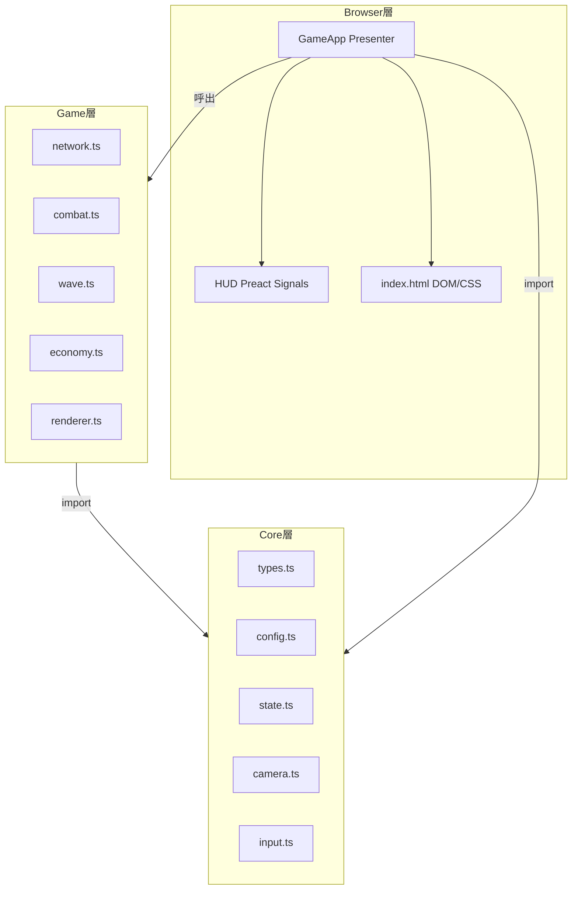
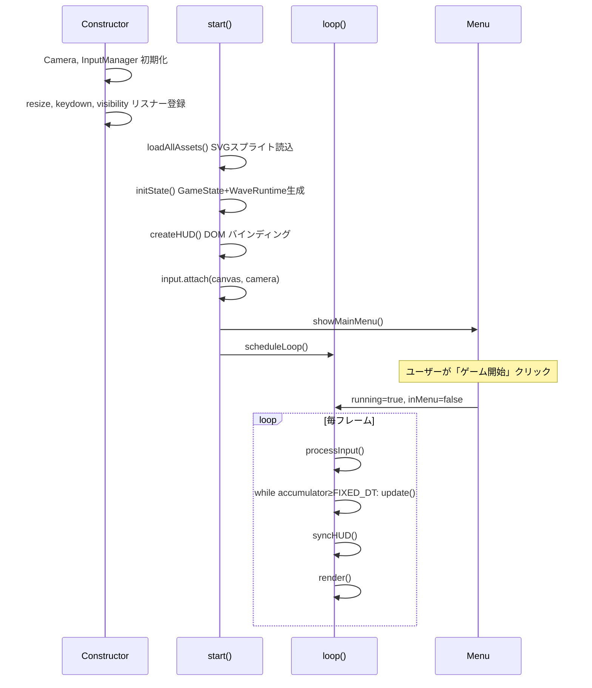
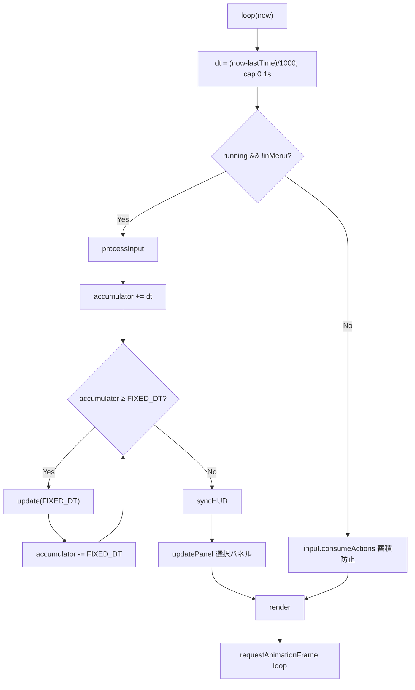
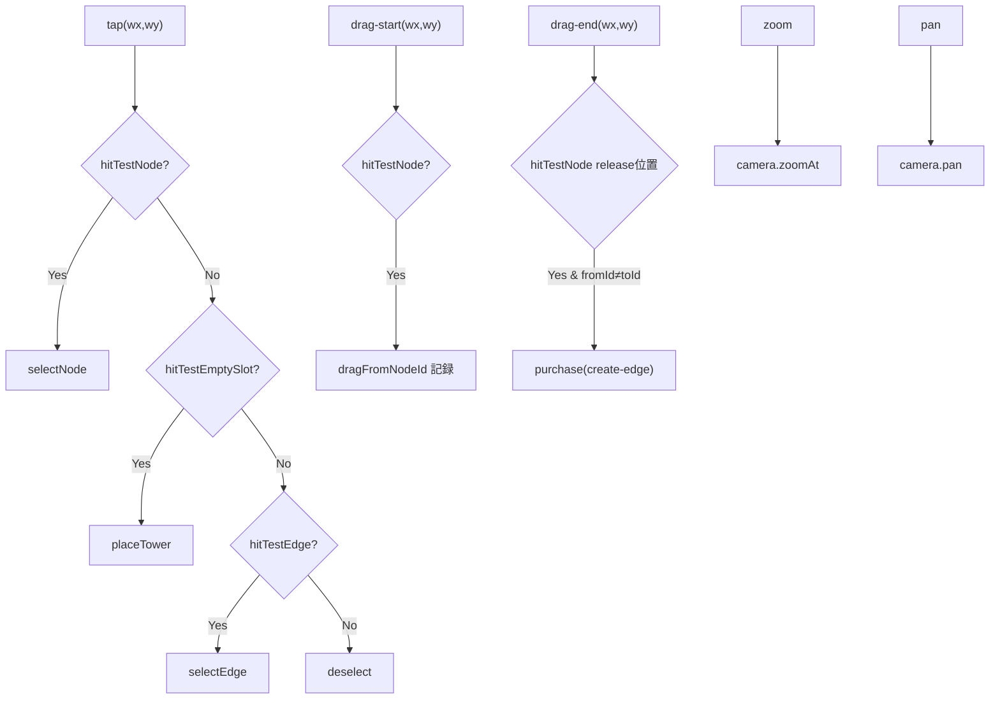
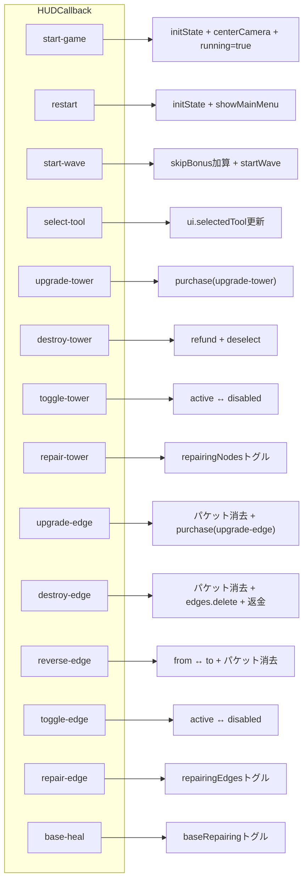
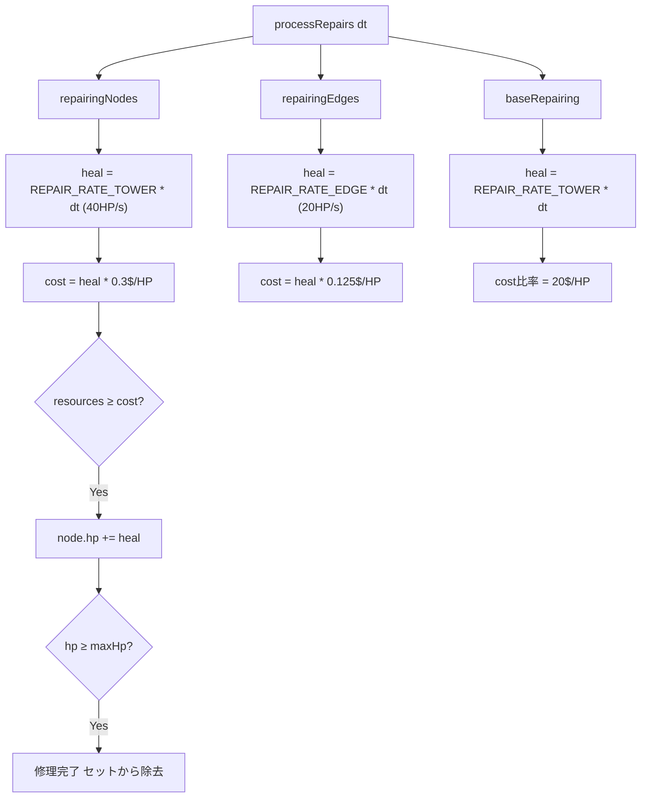
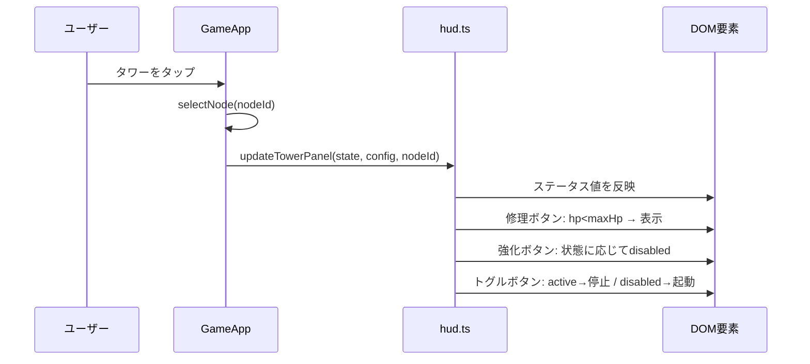
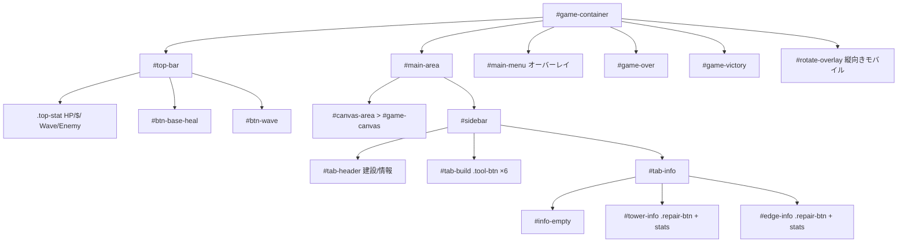

# Browser層 (`src/browser/`)

DOM操作・イベントバインディング層。Game層の関数を呼び出してUIと接続する。

## ファイル構成

| ファイル | 責務 |
|---|---|
| `game-app.ts` | `GameApp` クラス — ゲームループ統括（Presenter） |
| `hud.ts` | Preact Signals による HUD バインディング |

## アーキテクチャ

## GameApp ライフサイクル

### ゲームループ詳細

## 入力 → アクション変換

## HUDコールバック対応表

## 修理システム

## hud.ts — Preact Signals

### HUDSignals

| Signal | ソース |
|---|---|
| `baseHp` | `state.baseHp` |
| `resources` | `state.resources` |
| `waveIndex` | `state.waveIndex` |
| `enemyCount` | `state.enemies.size` |
| `gameResult` | `state.gameResult` |
| `waveCountdown` | `waveRuntime.waveCountdown` |
| `hpPercent` | computed: `baseHp / maxBaseHp * 100` |

### パネル更新フロー

## index.html DOM構造

