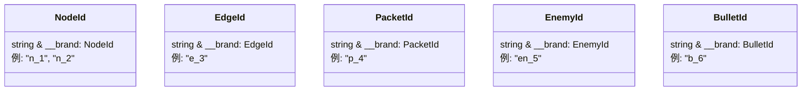
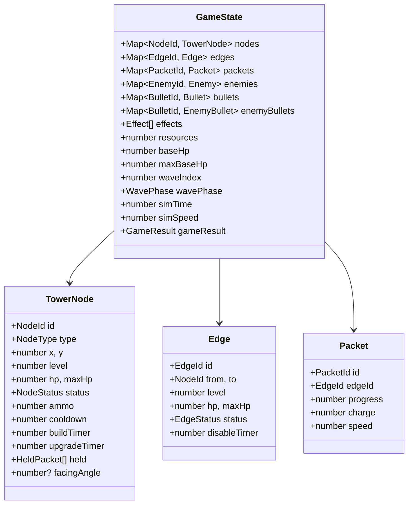
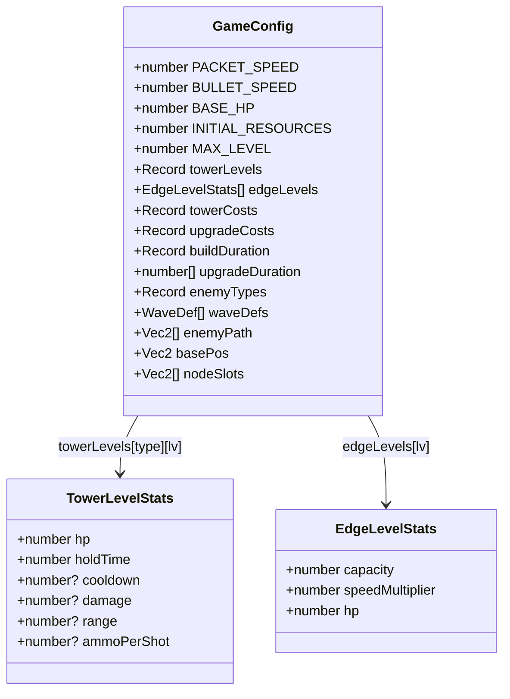
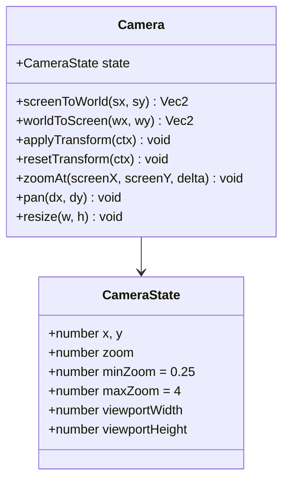
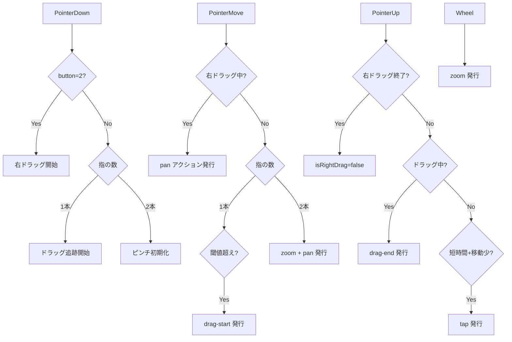
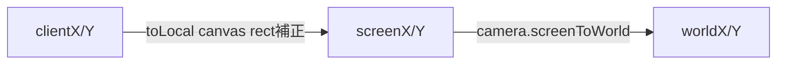

# Core層 (`src/core/`)

純粋データ層。DOM/Canvas非依存。型定義・状態管理・設定値・カメラ・入力を提供。

## ファイル構成

| ファイル | 責務 |
|---|---|
| `types.ts` | ブランド型ID、エンティティinterface、敵定義型 |
| `config.ts` | `GameConfig` interface + `GAME_CONFIG` 定数 + ヘルパー関数 |
| `state.ts` | `GameState` interface + ファクトリ + ID生成 + エッジ検索 |
| `camera.ts` | `Camera` クラス (zoom/pan/transform) |
| `input.ts` | `InputManager` クラス (Pointer Events → アクションキュー) |

## 型システム

### ブランド型ID

全IDは単一の`idCounter`から採番。`resetIdCounter()`でゲーム開始時にリセット。

### 状態型

| 型 | 値 |
|---|---|
| `NodeStatus` | `building`, `active`, `upgrading`, `disabled` |
| `EdgeStatus` | `active`, `upgrading`, `disabled`, `destroyed` |
| `NodeType` | `generator`, `sniper`, `rapid`, `cannon`, `distributor`, `repeater` |
| `EnemyType` | `normal`, `fast`, `tank`, `edgeAttacker`, `towerAttacker`, `disabler` |

## GameState

### エッジ検索ヘルパー

| 関数 | 説明 |
|---|---|
| `outgoingEdges(state, nodeId)` | `from === nodeId && active` |
| `incomingEdges(state, nodeId)` | `to === nodeId && active` |
| `edgesBetween(state, a, b)` | 双方向で接続されたエッジ |
| `connectedEdges(state, nodeId)` | `from` or `to` が一致する全エッジ |

## GameConfig

### ヘルパー関数

| 関数 | 入力 → 出力 |
|---|---|
| `getTowerLevelStats(config, type, level)` | → `TowerLevelStats` |
| `getEdgeLevelStats(config, level)` | → `EdgeLevelStats` |
| `getTowerCost(config, type)` | → `number` |
| `getUpgradeCost(config, type, level)` | → `number` |
| `getUpgradeDuration(config, level)` | → `number` |

## Camera

## InputManager

### アクション型

| type | パラメータ |
|---|---|
| `tap` | `worldX, worldY` |
| `drag-start` | `worldX, worldY` |
| `drag-end` | `worldX, worldY` |
| `zoom` | `centerX, centerY, delta` |
| `pan` | `dx, dy` |

### 入力 → アクション変換フロー

### 座標変換チェーン

