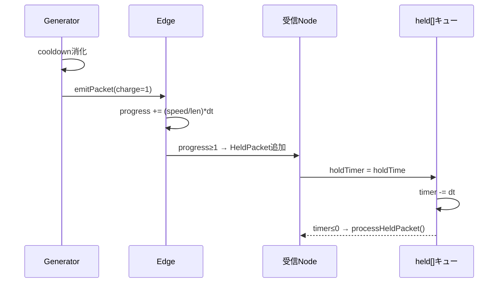
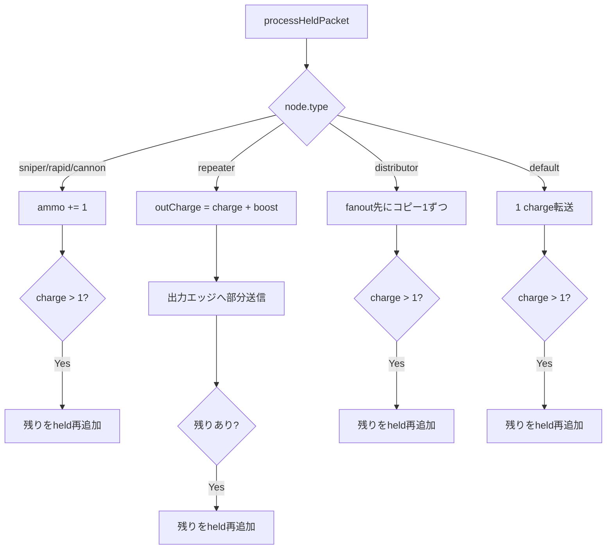
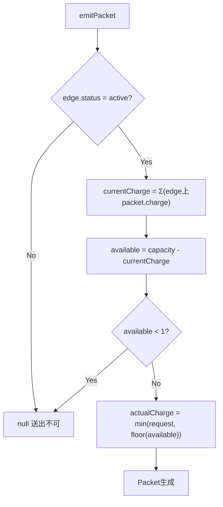
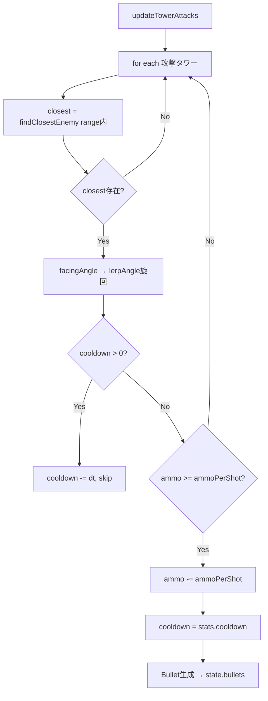
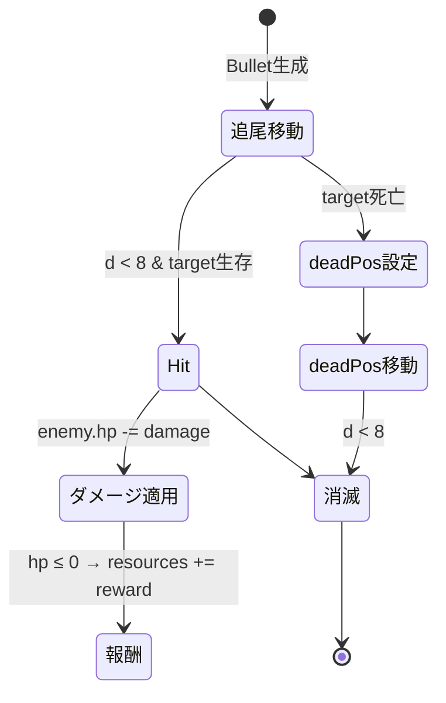
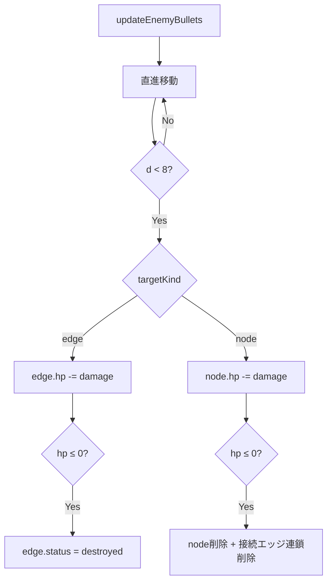
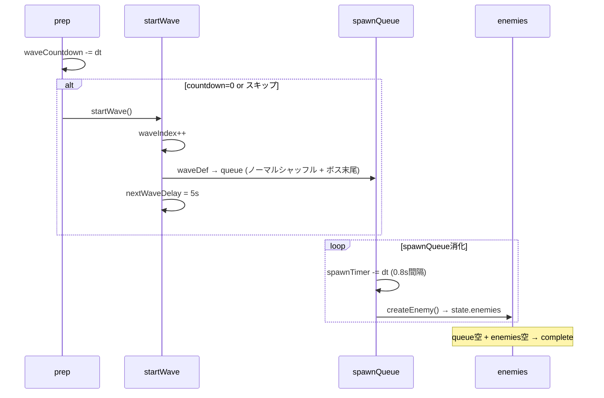
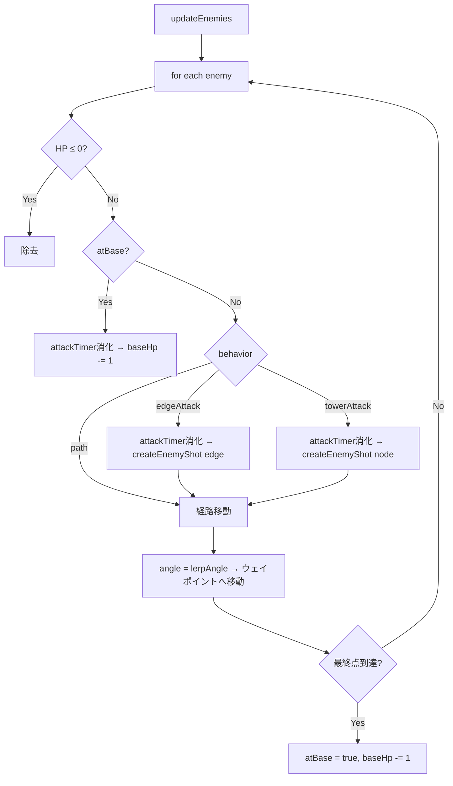
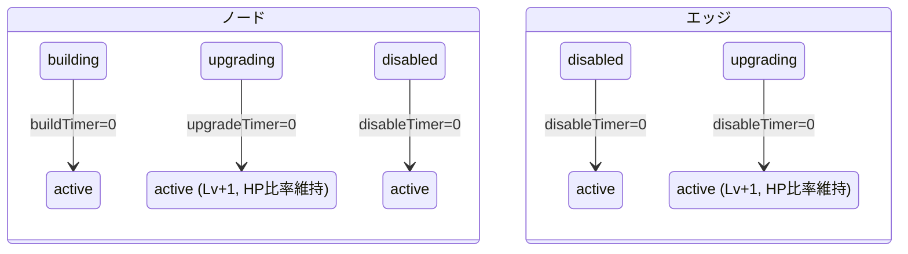
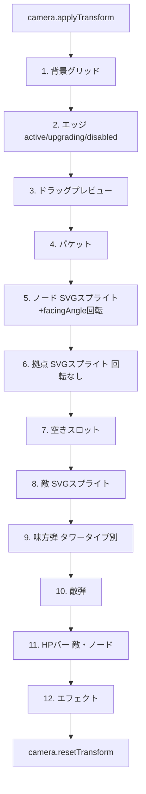

# Game層 (`src/game/`)

ゲームロジック層。Core層の型・状態を操作する純粋関数群。DOM/Canvas描画APIは`renderer.ts`のみ使用。

## ファイル構成

| ファイル | 責務 |
|---|---|
| `network.ts` | パケット生成・移動・保持キュー処理 |
| `combat.ts` | タワー攻撃・弾移動・命中判定・敵弾処理 |
| `wave.ts` | ウェーブ管理・敵スポーン・敵移動・敵攻撃 |
| `economy.ts` | 資源管理・購入・撤去返金・建設タイマー |
| `renderer.ts` | Canvas 2D描画・ヒットテスト・エフェクト |
| `scoring.ts` | スコア計算（予約） |

## network.ts — パケットネットワーク

### パケットライフサイクル

### ノードタイプ別パケット処理

### 容量制御

## combat.ts — 戦闘システム

### タワー攻撃フロー

### 弾移動・命中

### 敵弾命中

## wave.ts — ウェーブ管理

### ウェーブ進行シーケンス

### 敵移動アクティビティ

## economy.ts — 経済システム

### 購入アクション

| アクション | コスト源 | 状態変更 |
|---|---|---|
| `place-tower` | `towerCosts[type]` | Node生成 (status=building) |
| `upgrade-tower` | `upgradeCosts[type][lv-1]` | status=upgrading, upgradeTimer設定 |
| `upgrade-edge` | `edgeUpgradeCosts[lv-1]` | status=upgrading, disableTimer設定 |
| `create-edge` | `edgeCost (10)` | Edge生成 (status=active) |

### 建設タイマー処理

## renderer.ts — 描画システム

### 描画順序（Z-order）

### ヒットテスト

| 関数 | 判定 |
|---|---|
| `hitTestNode(state, config, wx, wy)` | ノード中心との距離 < NODE_RADIUS |
| `hitTestEmptySlot(state, config, wx, wy)` | スロット座標との距離 < NODE_RADIUS, 未使用 |
| `hitTestEdge(state, wx, wy)` | エッジ線分への最近接点距離 < 15px |
