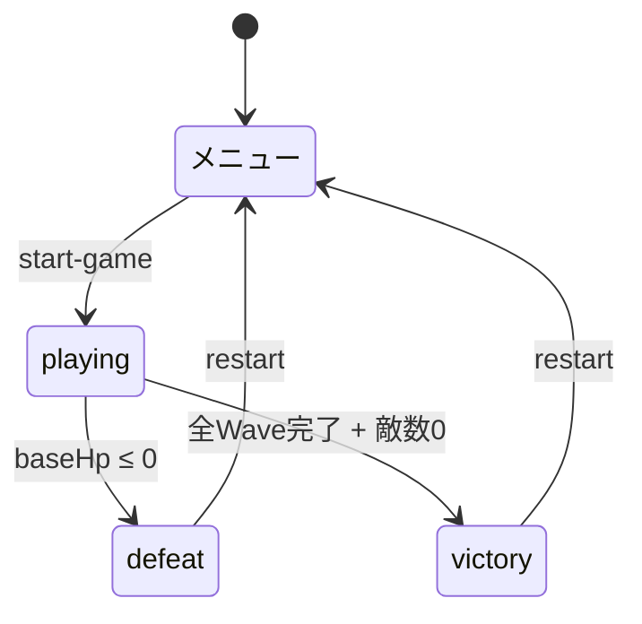
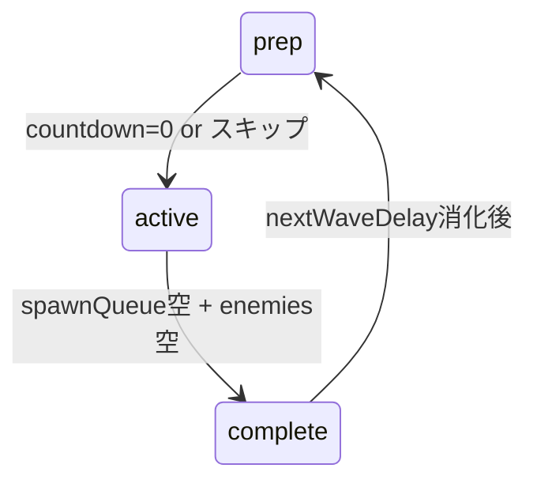
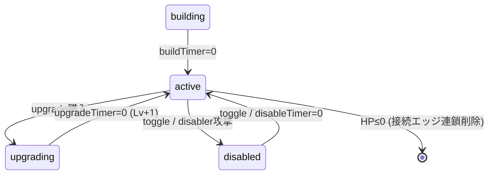
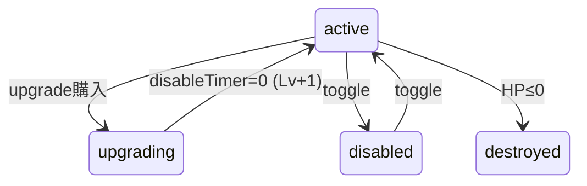
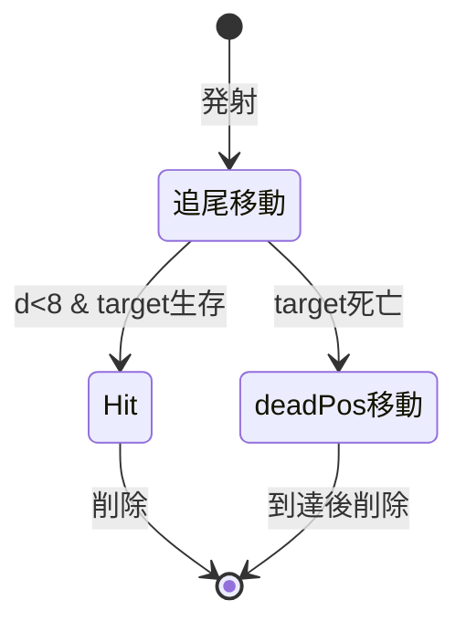
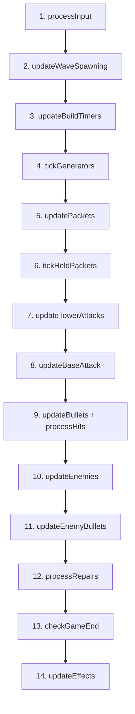
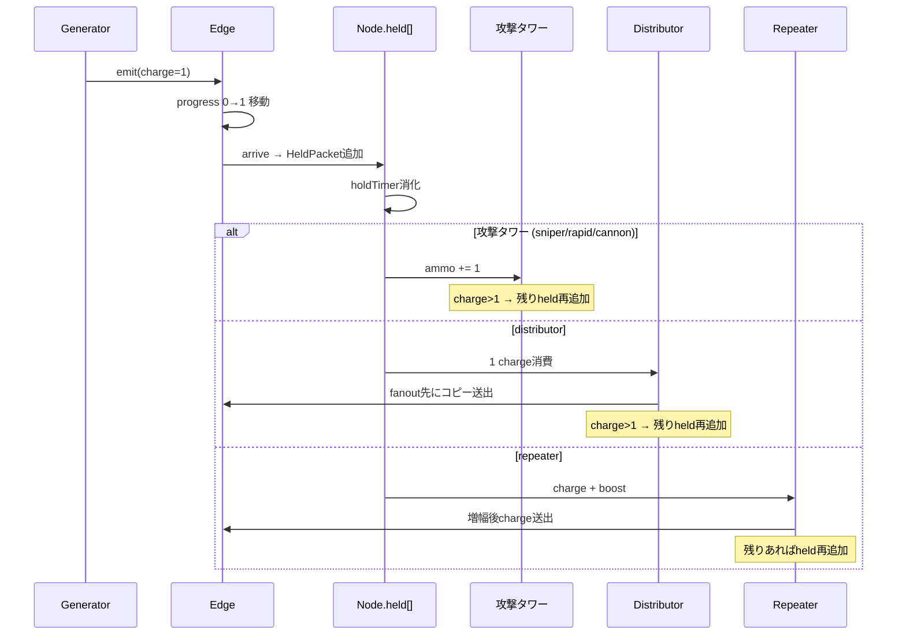
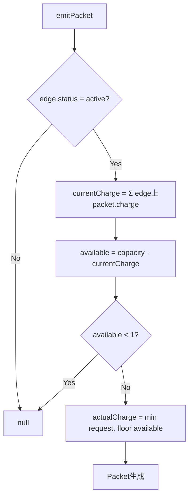

# ゲーム仕様書

## 概要

ネットワーク構築型タワーディフェンス。ジェネレータがパケットを生成し、エッジ（有向リンク）経由でタワーへ供給。タワーはパケットを弾薬として消費し敵を迎撃する。全30ウェーブを防衛すれば勝利。

## エンティティ一覧

| エンティティ | ID型 | 格納先 |
|---|---|---|
| タワーノード | `NodeId` | `state.nodes` |
| エッジ | `EdgeId` | `state.edges` |
| パケット | `PacketId` | `state.packets` |
| 敵 | `EnemyId` | `state.enemies` |
| 弾（味方） | `BulletId` | `state.bullets` |
| 弾（敵） | `BulletId` | `state.enemyBullets` |
| エフェクト | なし | `state.effects[]` |

## タワー種別

| 種別 | 役割 | パケット処理 |
|---|---|---|
| generator | パケット生成 | 出力エッジへ1 charge送出 |
| sniper | 高火力・狭範囲 | 1 charge → ammo +1 |
| rapid | 速射・低火力 | 1 charge → ammo +1 |
| cannon | 広範囲・中火力 | 1 charge → ammo +1 |
| distributor | マルチキャスト | 1 charge消費 → fanout先にコピー送出 |
| repeater | charge増幅 | charge + boost → 次エッジへ転送 |

## 敵種別

| 種別 | 行動 | 特殊 |
|---|---|---|
| normal | 経路移動 → 拠点攻撃 | - |
| fast | 経路移動 → 拠点攻撃 | 高速・低HP |
| tank | 経路移動 → 拠点攻撃 | 低速・高HP、ボス有 |
| edgeAttacker | 経路移動 + エッジ射撃 | エッジを破壊可能 |
| towerAttacker | 経路移動 + タワー射撃 | タワーを破壊可能 |
| disabler | 経路移動 → 拠点攻撃 | （予約枠） |

## 状態遷移図

### ゲーム全体

### ウェーブフェーズ (`state.wavePhase`)

### ノード状態 (`NodeStatus`)

### エッジ状態 (`EdgeStatus`)

### 弾ライフサイクル

## ゲームループ（1フレームの処理順序）

## パケットフロー

## エッジ容量制御

## 経済パラメータ

| パラメータ | 値 |
|---|---|
| 初期資源 | 600 |
| 最大レベル | 5 |
| 撤去返金率 | 50% |
| ウェーブスキップボーナス | 5$/秒 |
| 拠点回復 | 5HP / $100 |

## マップ構成

- 敵経路: 7点の折れ線（S字パス）
- ノードスロット: 33箇所（6行、固定座標）
- 拠点位置: (400, 555)
